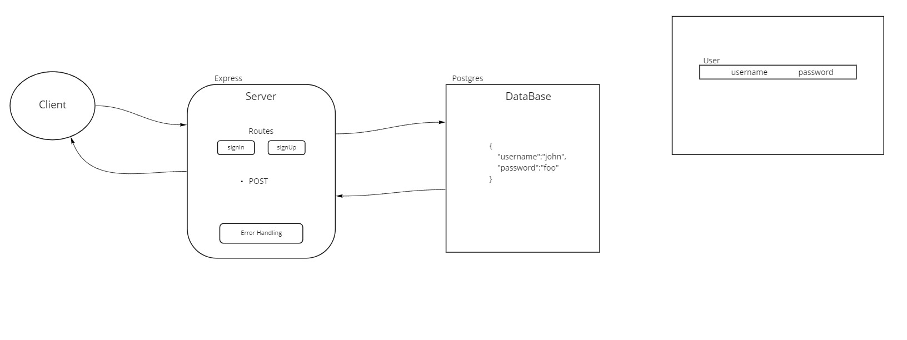

# basic-auth

Express server that implements Basic Authentication, with signup and signin capabilities, using a Postgres database for storage. for Code Fellows 401

## HTTP Express Server deployed on Heroku.

Deployed at: [basic-api-server](https://cf-401-basic-auth.herokuapp.com/)

## Installation

to install run `git clone git@github.com:Kellen-Linse/basic-auth`

`cd` into express-server-deployment

run `npm install`

## Usage

To start server run : `npm start`

## Routes

* POST `http://localhost:3000/signin` - Sign In
* POST `http://localhost:3000/signup` - Sign Up
  
## Features

* Basic Auth

* Object 

        {
            "username":"john",
            "password":"foo"
        }

        {
            "id": 11,
            "username": "john",
            "password": "$2b$10$Iik33GUA2aV/soxRQ7dOl.KrEDMPv3.Ab0IU9DTdKlGQQfCTiFlpq",
            "updatedAt": "2022-01-18T02:13:16.422Z",
            "createdAt": "2022-01-18T02:13:16.422Z"
        }